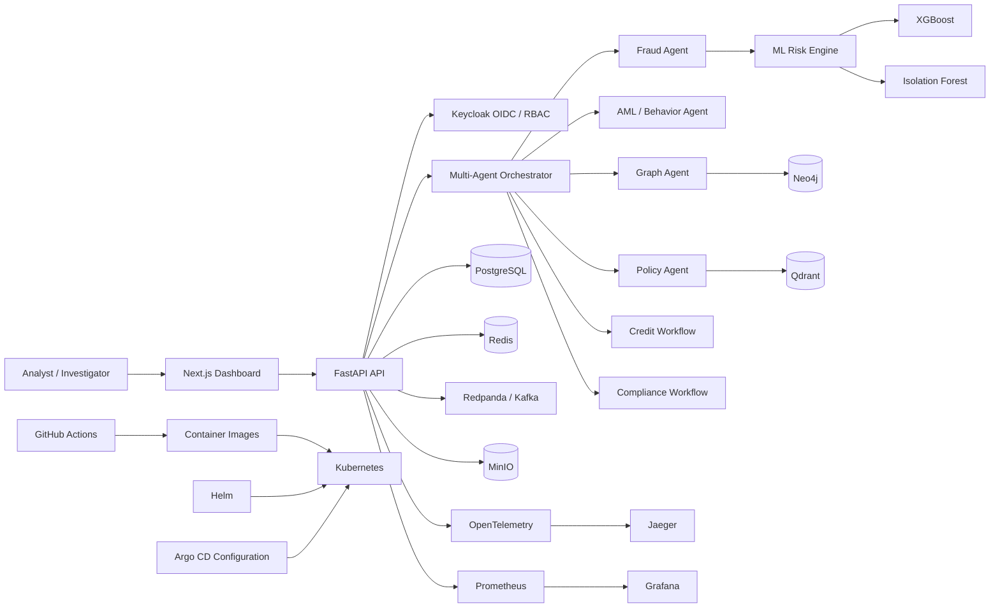

# FinSentinel AI

**Production-style, cloud-native multi-agent banking intelligence platform for fraud, AML, credit risk, compliance, and human-in-the-loop investigations.**

FinSentinel AI combines deterministic multi-agent orchestration, machine-learning risk scoring, graph intelligence, retrieval-augmented policy evidence, role-based security, observability, and Kubernetes delivery in one end-to-end banking AI platform.

> Built as a portfolio-grade engineering system to demonstrate applied AI/ML, backend architecture, MLOps, security, observability, and cloud-native delivery.

## Highlights

- **Multi-agent investigations** for fraud, AML, credit, and compliance workflows
- **ML risk intelligence** using XGBoost fraud scoring, Isolation Forest anomaly detection, credit-risk scoring, and explainability
- **Graph intelligence** with Neo4j for relationship and transaction-network analysis
- **Policy retrieval** with Qdrant for semantic evidence and grounded decision support
- **Human-in-the-loop governance** with review thresholds, approvals, case tracking, and audit logs
- **OAuth/OIDC + RBAC** using Keycloak with workflow-specific roles and permissions
- **Observability** with Prometheus, Grafana, OpenTelemetry, and Jaeger
- **Label-free drift monitoring** for online feature and prediction-distribution shifts
- **Cloud-native delivery** with Docker, Kubernetes, Helm, GitHub Actions, and Argo CD configuration
- **Next.js dashboard** backed by FastAPI services and banking-domain APIs

## System Architecture



See [`docs/ARCHITECTURE.md`](docs/ARCHITECTURE.md) for the detailed architecture and request flow.

## Investigation Flow

1. Transaction context enters the FastAPI banking API.
2. The ML risk engine computes fraud probability and anomaly signals.
3. The orchestrator runs the appropriate investigation workflow.
4. Specialized agents gather behavioral, graph, policy, and workflow evidence.
5. Evidence is aggregated into a combined risk assessment.
6. High-risk cases are routed to human review.
7. Decisions and security-relevant actions are written to the audit trail.
8. Metrics, traces, agent latency, model signals, and drift indicators are exported for operations.

The orchestrator includes timeout handling and failure isolation so one agent failure does not automatically collapse an entire investigation.

## Banking Workflows

| Workflow | Purpose | Example Signals |
|---|---|---|
| Fraud | Detect suspicious transactions | fraud probability, anomaly score, device risk, merchant risk |
| AML | Investigate suspicious activity patterns | behavioral anomalies, relationship evidence, transaction context |
| Credit | Support lending risk decisions | credit-risk score, application attributes, review thresholds |
| Compliance | Evaluate policy and control concerns | retrieved policy evidence, workflow rules, audit context |

## ML & AI Layer

### Fraud intelligence
The fraud pipeline combines supervised and unsupervised signals:
- XGBoost fraud probability
- Isolation Forest anomaly score
- contextual transaction risk factors
- combined risk scoring and severity classification

### Retrieval and graph intelligence
- **Qdrant** — semantic retrieval of policy and evidence
- **Neo4j** — relationship and transaction graph analysis

### Drift monitoring
The platform includes **label-free online drift monitoring** based on feature and prediction-distribution shifts. This provides an early operational signal while ground-truth labels may still be delayed.

## Security & Governance

FinSentinel uses Keycloak-based OAuth/OIDC authentication and RBAC.

Representative roles include:
- `fraud_analyst`
- `aml_investigator`
- `credit_analyst`
- `compliance_officer`
- `executive`
- `platform_admin`
- `auditor`

Authorization is enforced server-side at workflow boundaries. Audit records use the authenticated principal rather than trusting client-supplied identity.

## Observability

The platform exposes:
- HTTP request counts, latency, active requests, and errors
- workflow executions, failures, duration, and in-flight work
- agent executions, latency, timeouts, failures, confidence, and findings
- model fraud, anomaly, combined-risk, and credit-risk distributions
- human-review decisions and risk-level counts
- feature/prediction drift metrics
- distributed traces with OpenTelemetry and Jaeger

## Cloud-Native Delivery

FinSentinel includes Docker / Docker Compose, Kubernetes, Helm, liveness/readiness probes, HPA, PodDisruptionBudget, NetworkPolicy templates, GitHub Actions CI/CD, Argo CD Application configuration, and Kubernetes self-healing verification.

The repository contains Argo CD configuration; running Argo CD itself depends on the target cluster environment.

## Technology Stack

**Frontend:** Next.js, React, TypeScript, Tailwind CSS
**Backend:** FastAPI, Python, Pydantic, SQLAlchemy, Alembic
**AI/ML:** XGBoost, Isolation Forest, SHAP, multi-agent orchestration, RAG-style policy retrieval
**Datastores:** PostgreSQL, Redis, Qdrant, Neo4j
**Streaming & Object Storage:** Redpanda/Kafka, MinIO
**Security:** Keycloak, OAuth/OIDC, RBAC
**Observability:** Prometheus, Grafana, OpenTelemetry, Jaeger
**MLOps / Delivery:** Docker, Kubernetes, Helm, GitHub Actions, Argo CD configuration
**Testing / Quality:** pytest, Ruff

## Local Quick Start

```bash
cp .env.example .env
docker compose up --build
```

Common local endpoints:

| Service | URL |
|---|---|
| Web dashboard | `http://localhost:3000` |
| FastAPI docs | `http://localhost:8000/docs` |
| Grafana | `http://localhost:3001` |
| Prometheus | `http://localhost:9090` |
| Jaeger | `http://localhost:16686` |
| Neo4j Browser | `http://localhost:7474` |
| Qdrant Dashboard | `http://localhost:6333/dashboard` |
| MinIO Console | `http://localhost:9001` |
| Keycloak | `http://localhost:8080` |

## API Surface

Representative endpoints include:

```text
GET  /health/live
GET  /health/ready
GET  /metrics
POST /api/v1/transactions/score
POST /api/v1/investigations/run
```

The banking API also supports persisted customers, accounts, transactions, investigation cases, loan applications, approvals, and audit records.

## Demo Scenario

See [`docs/DEMO.md`](docs/DEMO.md) for a recruiter-friendly end-to-end walkthrough built around a suspicious transaction investigation.

## Repository Structure

```text
finsentinel-ai/
├── apps/
│   ├── api/
│   └── web/
├── infrastructure/
│   ├── helm/finsentinel/
│   ├── argocd/
│   └── observability/
├── docs/
├── scripts/
├── docker-compose.yml
└── README.md
```

## Engineering Goals

FinSentinel demonstrates the engineering work around AI systems: typed APIs, persisted domain models, secure access control, agent orchestration and failure isolation, ML inference and drift signals, graph/vector retrieval, human approval paths, auditability, observability, containerization, Kubernetes deployment, CI/CD, and GitOps configuration.

## Project Status

**v1.0 release candidate**

Core banking, AI/ML, multi-agent workflows, security, observability, drift monitoring, Kubernetes, Helm, CI/CD, and GitOps configuration are implemented. Final release validation and portfolio assets are the remaining release steps.

## Documentation

- [`docs/ARCHITECTURE.md`](docs/ARCHITECTURE.md)
- [`docs/DEMO.md`](docs/DEMO.md)
- [`docs/BUILD_PLAN.md`](docs/BUILD_PLAN.md)

## License

This project is intended as an engineering and portfolio demonstration. Add an explicit open-source license before redistributing or accepting external contributions.
