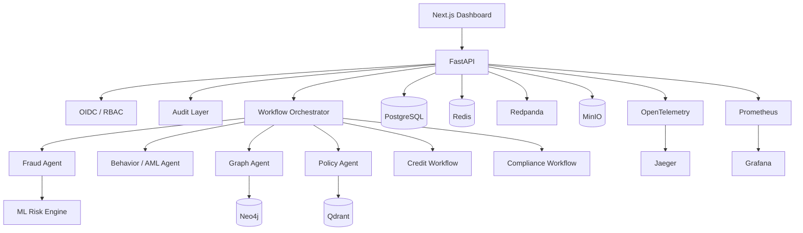
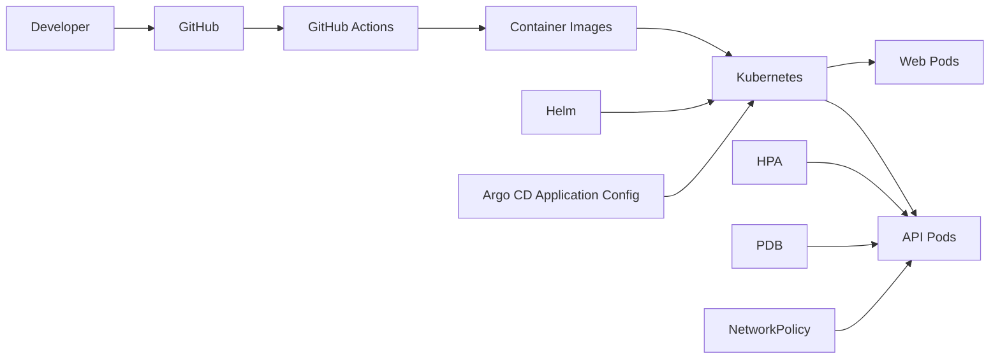

# FinSentinel AI — Architecture

## 1. System Purpose

FinSentinel AI is a production-style banking intelligence platform designed to demonstrate how machine learning, multi-agent orchestration, graph/vector retrieval, security, observability, and cloud-native deployment can work together in a regulated-domain architecture.

Primary workflow categories:
- fraud investigation
- AML investigation
- credit-risk decision support
- compliance investigation

## 2. High-Level Architecture

## 3. Banking Domain Layer

The persisted banking core includes customers, accounts, transactions, investigation cases, loan applications, approvals, and audit logs. SQLAlchemy models and Alembic migrations provide the relational persistence layer.

## 4. Risk Engine

The transaction-risk path combines transaction feature engineering, supervised fraud probability, unsupervised anomaly score, contextual risk factors, and combined risk classification.

The ML layer is separated from the orchestration layer. Agents consume risk intelligence rather than embedding model implementation directly inside workflow logic.

## 5. Multi-Agent Orchestration

Important resilience characteristics include:
- bounded agent execution time
- per-agent timeout handling
- failure isolation
- evidence aggregation
- workflow-specific dispatch
- human-review escalation

A non-critical agent timeout can therefore be represented as an investigation warning instead of automatically terminating the full workflow.

## 6. Retrieval Architecture

**Qdrant** is used for semantic retrieval of policy/evidence.
**Neo4j** is used for graph-oriented evidence such as customer, account, device, merchant, and transaction relationships.

The vector and graph systems solve different retrieval problems and are intentionally complementary.

## 7. Security Architecture

Authentication and authorization are based on Keycloak and OAuth/OIDC. The API validates bearer tokens and applies workflow-specific permissions.

Representative roles:
- fraud_analyst
- aml_investigator
- credit_analyst
- compliance_officer
- executive
- platform_admin
- auditor

Audit attribution is derived from the authenticated principal.

## 8. Human-in-the-Loop Governance

The governance path includes investigation cases, human-review flags, approvals, audit logging, risk-level classification, and policy evidence. Model/agent output remains distinct from final governed action.

## 9. Observability Architecture

Application telemetry covers requests, latency, active work, errors, and security denials. Agent telemetry covers executions, failures, timeouts, duration, confidence, and findings. Model telemetry covers fraud, anomaly, combined-risk, credit-risk, and drift signals.

OpenTelemetry and Jaeger support distributed tracing. Prometheus and Grafana provide metrics collection and visualization.

## 10. Drift Monitoring

The platform implements label-free drift monitoring for operational use before delayed labels become available. It compares online feature/prediction behavior against a reference window and exposes normalized shift signals.

This is intentionally described as **distribution drift**, not model-accuracy degradation, because delayed or absent labels cannot directly prove predictive-performance decline.

## 11. Deployment Architecture

The repository contains Argo CD Application configuration. Argo CD must still be installed/configured in the target environment before that manifest becomes an active GitOps controller.

## 12. Failure Boundaries

- agent timeout → isolate individual agent
- model/agent warning → retain evidence and continue when appropriate
- pod failure → Kubernetes workload reconciliation
- application failure → liveness/readiness health signaling
- deployment failure → Helm rollback behavior
- drift signal → operational inspection path
- authorization failure → reject before protected workflow execution

## 13. Production Extensions

A real bank deployment would typically add managed secrets/KMS, private networking and ingress/WAF, managed databases, formal model-registry approval gates, delayed-label performance monitoring, data lineage/retention, SIEM integration, regulatory control mapping, disaster recovery, workload identity, and production GitOps environments.

These are explicitly listed as extensions so the portfolio does not claim controls that are not actually deployed.
